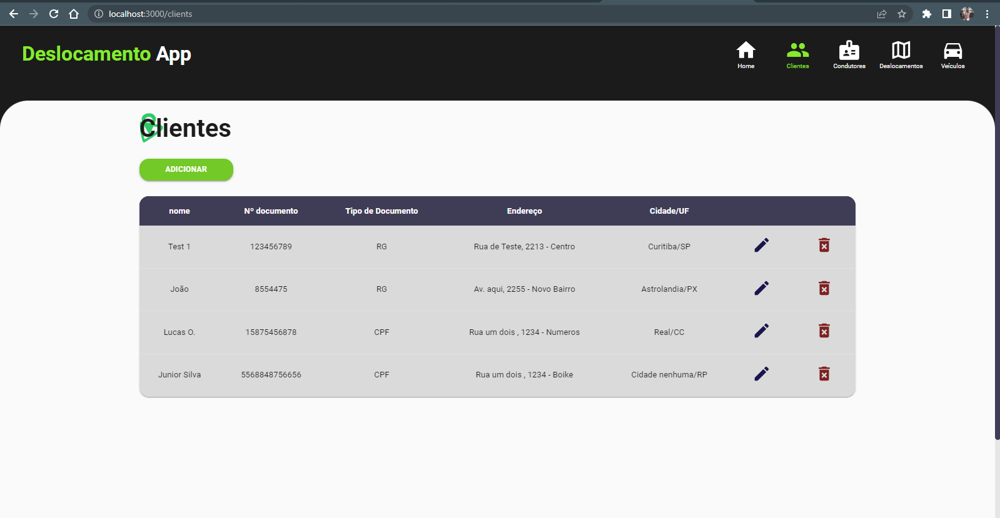

# projeto-api-deslocamento

<h1>Projeto Deslocamento App</h1>

<h2 style="font-family: sans-serif;">Sobre o projeto:</h2>

  Esse projeto faz parte de um desafio de Desenvolvimento Front-End - Aplicação de Deslocamento que consiste em desenvolva uma aplicação front-end utilizando ReactJS com TypeScript, framework Next.js e a biblioteca Material-UI, permitindo aos usuários interagir com a API Deslocamento para realizar operações relacionadas a clientes, condutores, deslocamentos e veículos.

<h2 style="font-family: sans-serif;">Objetivo do Projeto Deslocamento App:</h2>

O objetivo do projeto consiste em criar uma aplicação de gerenciamento de serviçes de transporte particular de clientes. 

<h2 style="font-family: sans-serif;">Como utilizar os códigos desse repositório:</h2>

    Caso queira utilizar o código presente nesse repositório basta cloná-lo para sua máquina e utilizar o comando npm install no terminal do seu Editor de código para instalar node_modules e suas dependências. Após isso você poderá rodar a aplicação utilizando o comando npm run dev.

<h2 style="font-family: sans-serif;">Linguagens e bibliotecas utilizadas:</h2>

<ul>
    <li>React.js</li>
    <li>Next.js</li>
    <li>HTML(TSX)</li>
    <li>CSS</li>
    <li>TypeScript</li>
    <li>React Toastify</li>
    <li>API Deslocamento</li>
</ul>

<h2 style="font-family: sans-serif;">Layout:</h2>

 

 

 

 

 

 

 

 

 

<h2 style="font-family: sans-serif;">Autor</h2>

Lucas Oliveira

<h2 style="font-family: sans-serif;">Links</h2>

<a href="http://www.linkedin.com/in/lucas-de-oliveira-5b8a5532" target="_blank">LinkedIn</a>
 